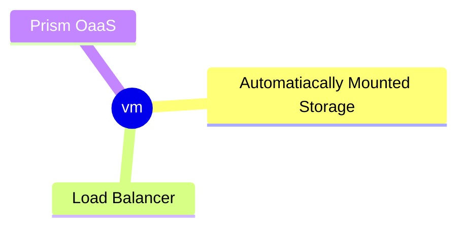
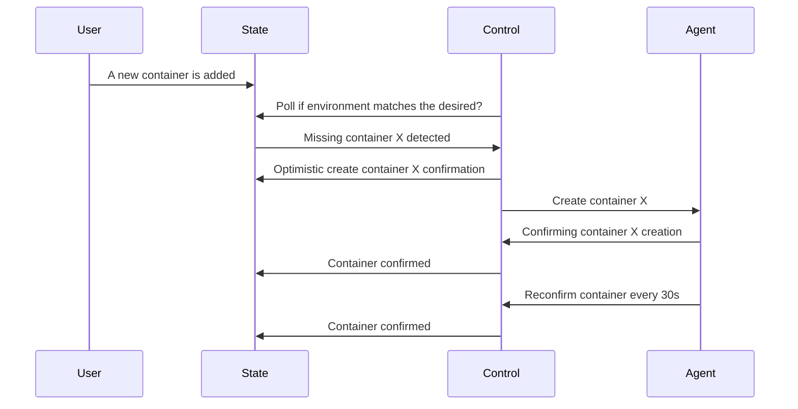
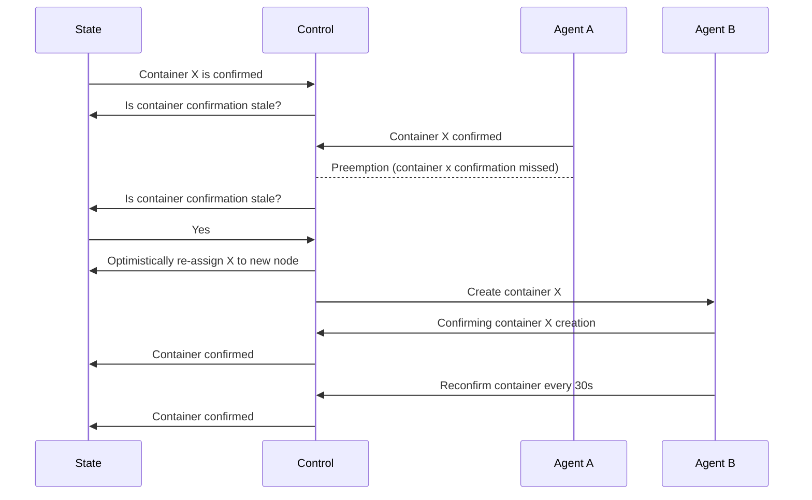
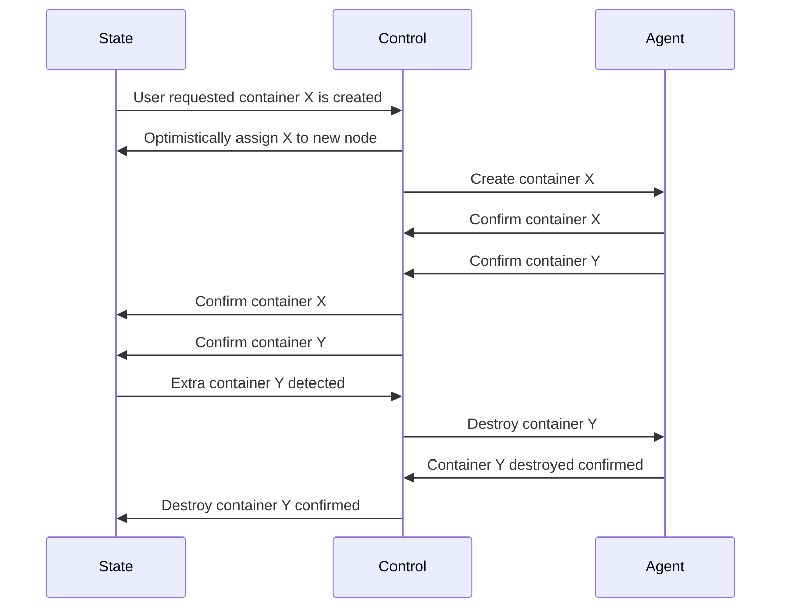
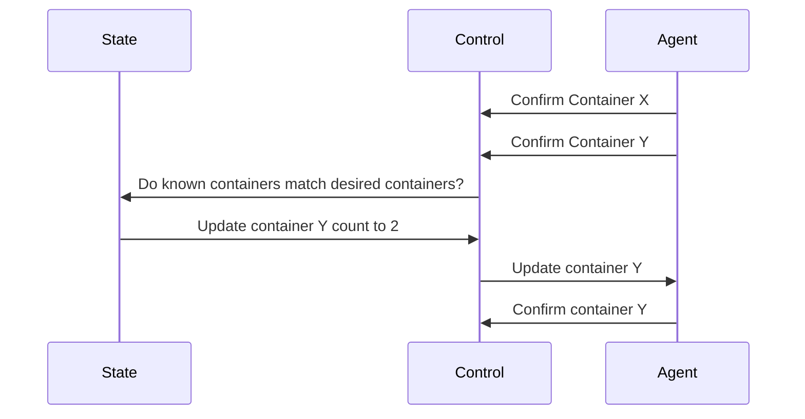

# Prism OaaS

A lightweight orchestrator for cheaply running containers that are resilient
even to instances being destroyed and restarted. This means that the
containers must be able to run on spot instances and come back up as soon as
a new instance is assigned

## Problem statement

Everything is a container... or at least it should be. I'm a huge fan of containers
and really love the idea of dependencies being simple to deliver with the application.

There is something that I don't love about containers and that is trying to reliably
host them cheaply.

---

For context, lets think about this example because it requires running multiple containers.
I.E. Running a Laravel application may involve up to three docker containers.
The web app, scheduler, and queue worker. These absolutely shouldn't require
three separate VMs.

I've explored a few scenarios and most of them end up costing more than I'd like
to pay as a hobbyist but I'd still like to run these containers somewhere.

---

So what options have I explored and why didn't they work out for me?

1. Run a simple container or docker compose service on a VM.
   - This option is the simplest but cannot withstand a node being preempted.
1. Run a single node docker swarm container.
   - This allows me to expand past a single node but still has the issue of being
     unable to withstand preemption
1. Run self-managed k3s/k0s
   - Surprisingly running on commodity hardware (1 vcpu and 2GiB memory) is still kinda expensive.
   - Installing k3s on this hardware left no room for running an actual application meaning we need to run
     at least two vms just to deploy one container.
1. Run ECS/Fargate
   - ECS is a little closer because you don't have to pay for the control plane
     but Fargate is not a cheap service and running a simple Laravel application
     still used three separate Fargate instances and incurred those costs
1. Run ECS/EC2 Auto-Scaling
   - ECS once again has a free control plane but setting up EC2 auto-scaling
     has it's own complications and generally it is recommended to just use
     Fargate.
   - Also ECS service discovery is very strange and in some cases can require
     using files uploaded to S3 in order for services to find each other.
     Potentially AWS Service Connect is supposed to remedy this but when I last
     used AWS Service Connect it was still in beta and wasn't working
1. Run managed kubernetes
   - Shooting a fly with a bazooka. The most expensive. The most reliable.
     Resilient to preemption.

The most ideal situation, for me, would be that we can run multiple applications
on a single node easily. Eventually it would be great to be able to handle
service discovery and multi-node applications. For now, I'll be happy with
a single node resilient application that can withstand preemption.

On top of that you should be able to run two or three Laravel applications
all on the same machine.

Next, it would be amazing if the system were durable enough to be able to be
scheduled on spot instances and survive preemption. Knowing that this would
cause downtime since we are targeting hobby applications and not HA apps.

---

Enough of the current ecosystem. Let's talk about the solution.

## Yet another managed service

Maybe this will turn into nothing but I thought it might be nice to have a
simple Orchestrator as a Service that can place a container on a VM for me.
Especially, if that VM can be terminated at any time and the orchestrator will
re-assign it for me.

This means that the VM would have to be setup in a specific way. So storage
has to be configured outside of the VM and ingress has to be stored outside
of the VM. These should be relatively cheap compared to the cost of the VM.

In the previous diagram everything is stable except for the VM which can be
removed and replaced at any time and Prism will re-assign the missing
container.

Ideally, the VM will boot a specific AMI and the user data for the VM will
associate the vm automatically to Prism so the correct containers can be
assigned to it.

---

## Architecture

The Prism control plane runs an embedded NATS cluster. The agents use embedded
NATS clients. All communication is done over NATS subjects. When Prism control
wants to assign a container it writes the container details to a subject
and the agent will execute the necessary docker API commands to create the
container.

Create a container

 ---

Node is deleted

---

Delete excess container

---

Update a container

## Code

- [Control Monitor](cmd/control/monitor.go)
- [Control Processor](cmd/control/processor.go)
- [Agent](cmd/agent/main.go)
- [State](internal/state/state.go)

## Demo

- Boot and place three containers
- Delete a container and it is replaced after 30 seconds

## Development Requirements

Development tools required are as follows:

- [vagrant](https://www.vagrantup.com/)
- [just](https://github.com/casey/just)

1. Bring up development VMs and control process with `just dev`.

This will start a modd process which monitors all go files.
It will rebuild and run the control process on your local computer.
It will rebuild the agent as linux-amd64, push the image into vagrant,
move it into location, and restarts the systemd unit for the agent,
finally it will start monitoring the output of the agent.

